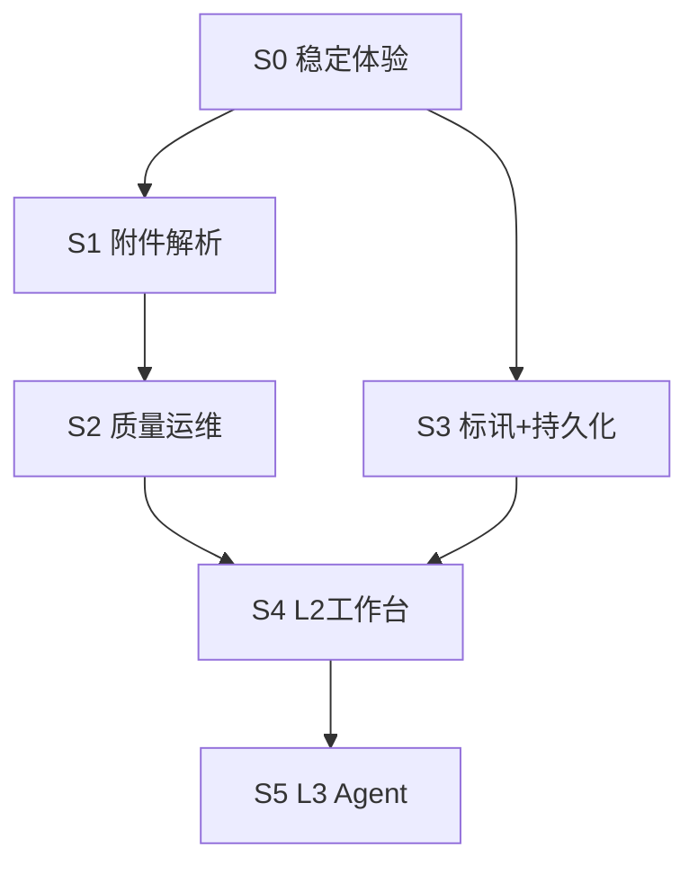

# 标书分析线 · 开发计划（2026-06-02 排期）

> 范围：`tender-info` → `tender-analysis` → `tender-product-analysis`  
> 原则：先 Tools（L1）稳、再编排（L2）、最后 Agent（L3）；**附件参数**为产品分析核心路径。

---

## 总览

| 阶段 | 周期（建议） | 主题 | 里程碑 |
|------|--------------|------|--------|
| **S0** | 2–3 天 | 稳定与体验补齐 | 三条线可演示、边界清晰 |
| **S1** | 1–2 周 | 附件参数闭环（P0） | 有附件项目参数完整度 ≥85% |
| **S2** | 1 周 | 质量与运维（P1） | 可抽检、可重跑、词典可配 |
| **S3** | 1–2 周 | 标讯增强 + 持久化（P1） | 市场报告可读、任务不丢 |
| **S4** | 2–3 周 | L2 编排 + 工作台（P2） | 一条链路走完 + 轨迹 UI |
| **S5** | 按需 | L3 对话 Agent | Chat 调三条 `/run` |

---

## 依赖关系

---

## S0 · 稳定与体验补齐（2–3 天）

**目标**：现有 L1 可稳定演示，用户不踩坑。

| 序 | 任务 | 模块 | 交付标准 |
|----|------|------|----------|
| 0.1 | 多页抓取压测 + 翻页修复 | tender-info | [x] 增补 j-pagination 选择器 |
| 0.2 | 完成页文案：列表 vs 详情 vs 产品分析 | tender-info | [x] resultNextSteps 引导 |
| 0.3 | 工作门户「标书线」引导卡片 | 门户 index | [x] tender-line-guide |
| 0.4 | manifest 备注：product-analysis L1+ | manifest | [x] |
| 0.5 | 回归：产品分析按钮 + 页内表 + 去重 | product-analysis | [x] |

**出口**：业务可走完「检索 → 产品分析 → 页内看表」。

---

## S1 · 附件参数闭环（1–2 周）【最高优先级】

**目标**：实现用户核心诉求——**附件 PDF/Word 产品清单 + 参数** 并入统筹表。

| 序 | 任务 | 模块 | 交付标准 |
|----|------|------|----------|
| 1.1 | 剑鱼详情页附件下载 | product-analysis | [x] `attachment_fetcher.py` |
| 1.2 | PDF 文本/表格抽取（PyMuPDF） | product-analysis | [x] |
| 1.3 | Word 抽取（python-docx） | product-analysis | [x] |
| 1.4 | 附件文本 → `product_matcher` | product-analysis | [x] `apply_attachment_products` |
| 1.5 | 合并优先级：附件 > 详情 | product-analysis | [x] `merge_product_lists` |
| 1.6 | 进度阶段 + 门户勾选 | product-analysis | [x] `parse_attachments` 默认开 |
| 1.7 | 验收集：10 个有附件项目人工对表 | QA | [ ] 待业务验收 |

**出口**：GAPS #4 #5 勾选完成；可对外称 **L1+（产品参数分析）**。

---

## S2 · 质量与运维（1 周）

**目标**：结果可解释、长跑可恢复。

| 序 | 任务 | 模块 | 交付标准 |
|----|------|------|----------|
| 2.1 | 未命中 / 低分项目列表（门户 Tab） | product-analysis | [x] `match_audit` + 未命中 Tab |
| 2.2 | 属性词典外置 `product_attributes.json` | product-analysis | [x] 热加载同义词 |
| 2.3 | 失败重跑（按 report_id 或 job） | product-analysis | [x] `from_report_id` + retry_mode |
| 2.4 | 默认「仅分析有附件」可配置 + 说明 | product-analysis | [x] 勾选 + 说明文案 |
| 2.5 | 单元测试：表解析 + 匹配 + 去重 | product-analysis | [x] matcher/audit/attachment |

**出口**：运营可抽检；迭代匹配规则不靠发版。

---

## S3 · 标讯增强 + 任务持久化（1–2 周，可与 S2 并行）

**目标**：市场分析可读；检索任务重启不丢。

| 序 | 任务 | 模块 | 交付标准 |
|----|------|------|----------|
| 3.1 | tender-info 任务落盘（SQLite 或 JSON 索引） | tender-info | [x] `_jobs_index.json` + `job_meta.json` |
| 3.2 | 历史任务列表 UI | tender-info | [x] 历史任务区 + `/restore` |
| 3.3 | 标讯分析：页内 HTML 预览 iframe | tender-analysis | [x] reportFrame 页内预览 |
| 3.4 | 标讯报告 LLM 执行摘要（1 段 + 3 条洞察） | tender-analysis | [x] `llm_summary.py` + HTML/门户摘要 |
| 3.5 | 上传 CSV 独立 `/run`（可选） | tender-analysis | [x] `POST /run/upload` |

**出口**：info + analysis 达到 **生产级 L1**。

---

## S4 · L2 编排 + 智能体工作台（2–3 周）

**目标**：一条业务链路 + 可演示的智能体形态（对齐 annual-report）。

| 序 | 任务 | 模块 | 交付标准 |
|----|------|------|----------|
| 4.1 | 「标书一站式」向导：info → 选分析类型 → 自动跑 | 门户 | [x] 首页关键词入口 + 检索引导 |
| 4.2 | 跳转原文站（政采云等）模板 | product-analysis | 剑鱼无全文时补抓 |
| 4.3 | 产品分析三栏 UI：对话 / 轨迹 / 交付物 | product-analysis | 参考 annual-report |
| 4.4 | 执行日志写入轨迹面板 | product-analysis | 详情/附件阶段可见 |
| 4.5 | 我司产品库对标字段（可选） | product-analysis | 宽表增加对标列 |

**出口**：L2 编排成立；GAPS #10 #15 推进。

---

## S5 · L3 对话 Agent（按需）

| 序 | 任务 | 交付标准 |
|----|------|----------|
| 5.1 | Chat Tool：`tender_info_run` | 对话触发检索 |
| 5.2 | Chat Tool：`tender_product_run` | 对话触发产品分析 |
| 5.3 | Chat Tool：`tender_analysis_run` | 对话触发标讯报告 |
| 5.4 | 结果解读 prompt + 引用 report_id | 回答带数据出处 |

**前置**：S1–S3 稳定后再做，避免 Agent 调用不稳定工具。

---

## 资源与风险

| 风险 | 缓解 | 负责阶段 |
|------|------|----------|
| 剑鱼反爬 / 验证码 | 有头模式、登录态复用 | S0、S1 |
| 附件格式杂乱 | 先 PDF+docx，ZIP/OCR 放 S4 | S1 |
| 三模块边界混淆 | S0 门户引导 + SKILL 文案 | S0 |
| portal 改代码需重启 | 文档 + 重启按钮 | 全程 |
| LLM 成本 | 标讯摘要可开关 | S3 |

---

## 本周建议执行顺序（若 1 人开发）

| 天 |  focus |
|----|--------|
| D1 | S0.1 + S0.5 压测与回归 |
| D2 | S0.2 + S0.3 文案与门户引导 |
| D3–D5 | S1.1 附件下载 |
| D6–D8 | S1.2–1.4 PDF/Word + 匹配合并 |
| D9 | S1.6–1.7 进度 UI + 验收 |
| D10+ | S2 或 S3 按业务优先级二选一 |

---

## 文档同步

| 事件 | 更新文件 |
|------|----------|
| 每阶段完成 | `tender-product-analysis/GAPS.md`、`PROGRESS.md` 对应节 |
| S1 完成 | manifest 描述改为「含附件参数解析」 |
| 每日站会 | `portal/reports/daily/` 或 PROGRESS 追加一行 |

---

## 验收总表（整条线「做完」的定义）

- [ ] 用户：标书信息获取 → 产品分析 → **页内看表**（无需 Excel）✅ 已基本达成  
- [ ] 有附件项目：**参数列**来自 PDF/Word，非仅详情正文  
- [ ] 同关键词：**无重复垃圾行**，未命中可解释  
- [ ] 标讯分析：HTML + **文字摘要**  
- [ ] 任务重启不丢、历史可查  
- [ ] （可选）对话一句话跑完全链路  
